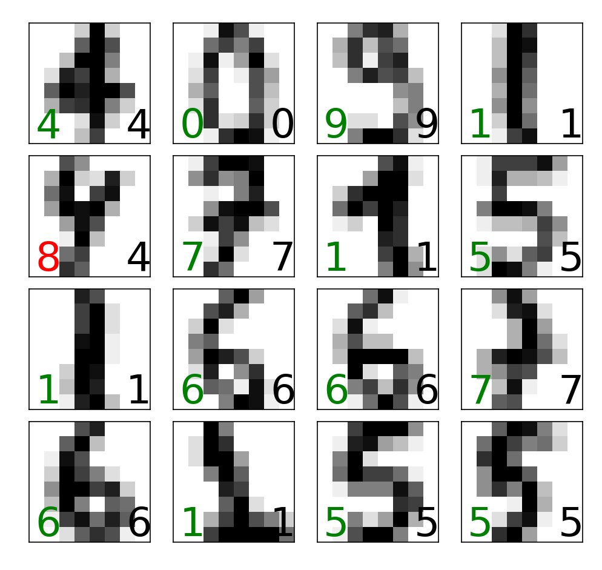

### “基于scikit-learn的手写数字数据集的机器学习”的学习报告

####一、相关包的安装

**scikit-learn：** 

由于我的Pycharm配置了Anaconda环境，所以下载这个包还是很简单的。只需要在Anaconda Prompt中执行这条指令就可以了：

`conda install scikit-learn`

**matplotlib：** 

这个包之前下载过，但后面用不了了，会报错，于是只能卸载后重新安装。还是在Anaconda Prompt中执行指令：

```
conda uninstall matplotlib
conda install matplotlib
```

但是还是会报错，报错内容如下：

>MatplotlibDeprecationWarning: 
Support for FigureCanvases without a required_interactive_framework attribute was deprecated in Matplotlib 3.6 
and will be removed two minor releases later.
plt.figure(figsize=(8, 6), dpi=200)

这时我以为是包的版本与环境不兼容的问题，于是我检查了我电脑配置版本：

>matplotlib 3.7.2
>numpy 1.25.2
>Python 3.9.12

在经过上网搜索资料之后，我发现其实这几个包和我的python环境是兼容的。于是排除了因为不兼容问题而报错的情况，接着我继续在Google当中搜索这个ERROR的解决
方法。在matplotlib官网搜索到这是这个包在3.6.0之后的版本API变更引起的bug。在Stack Overflow中有一个帖子[MatplotlibDeprecationWarning: Support for FigureCanvases without a required_interactive_framework attribute](https://stackoverflow.com/questions/74230433/matplotlibdeprecationwarning-support-for-figurecanvases-without-a-required-inte) 
也是遇到了和我一样的问题，里面提到了是没有配置matplotlib的后端导致的这个ERROR。加入这一行代码就能运行了：
`plt.switch_backend('TkAgg')` 。这里我所配置的是`TkAgg`后端。

>matplotlib内置的后端名称
>
>交互式后端:
GTK3Agg, GTK3Cairo, MacOSX, nbAgg,
Qt4Agg, Qt4Cairo, Qt5Agg, Qt5Cairo,
TkAgg, TkCairo, WebAgg, WX, WXAgg, WXCairo
>
>非交互式后端:
agg, cairo, pdf, pgf, ps, svg, template

#### 二、代码复现

**1 加载数据集**

- 导入数据库，并加载数据库信息

    ```
    from sklearn.datasets import load_digits
    digits = load_digits()      # 手写数字的数据集
    images_and_labels = list(zip(digits.images, digits.target))      # zip() 函数用于将可迭代的对象作为参数，将对象中对应的元素打包成一个个元组，然后返回由这些元组组成的列表。
    
    ```

- 把前八个样本在figure中画出来

    ```angular2html
    import matplotlib.pyplot as plt
    plt.figure(figsize=(8, 6), dpi=200)
    for index, (image, label) in enumerate(images_and_labels[:8]):
        plt.subplot(2, 4, index+1)
        plt.axis('off')  # 关闭坐标轴
        plt.imshow(image, cmap=plt.cm.gray_r, interpolation='nearest')  # 对图像进行处理
        plt.title('Digit:%i' % label, fontsize=20)
    plt.show()
    ```
    一开始我很疑惑为什么执行了画图的代码但是并没有窗口弹出来figure的图像，后面发现是没有加上`plt.show()`这一行代码。只有加上这一行代码，图像才会以窗口的形式弹出来。并且要在设置->工具->python scientific中勾掉“show plots in toolwindow”这个选项。
    
    

- 输出图像的信息

    ```angular2html
    print("shape of raw image_data:{{0}".format(digits.images.shape))
    print("shape if data:{0}".format(digits.data.shape))
    ```
  
    输出结果：
    ```
    shape of raw image_data:(1797, 8, 8)
    shape if data:(1797, 64)
    ```
**2 划分训练集和测试集**

- 划分训练集和测试集

    这里由`test_size=0.20` 可知，我们把数据集分成两个部分，20%是测试集，80%是训练集。
  
    ```angular2html
    from sklearn.model_selection import train_test_split
    X_train, X_test, y_train, y_test = train_test_split(digits.data, digits.target, test_size=0.20, random_state=2)
    ```

**3 训练模型**

- 训练模型

    这里用逻辑回归logistic进行训练模型。
    
    ```angular2html
    from sklearn.linear_model import LogisticRegression
    clf = LogisticRegression(solver='lbfgs', multi_class='ovr', max_iter=5000, random_state=42)
    clf.fit(X_train, y_train)
    ```
- 输出逻辑回归模型的信息：
    ```angular2html
    print(clf.fit(X_train, y_train))
    ```
  输出结果：
  ```angular2html
  LogisticRegression(max_iter=5000, multi_class='ovr', random_state=42)
  ```
  
**4 测试模型**

- 测试模型
  
    ```angular2html
    accuracy = clf.score(X_test, y_test)
    ```
  
- 输出逻辑回归模型的得分：
    ```angular2html
    print('Accuracy score of the {{} is {:.2f}'.format(clf.__class__.__name__, accuracy))
    ```
  输出结果：
    ```angular2html
    Accuracy score of the LogisticRegression is 0.94
    ```

- 以图像的形式显示出来

    ```angular2html
    y_pred=clf.predict(X_test)
    fig, axes=plt.subplots(4, 4, figsize=(8,8))
    fig.subplots_adjust(hspace=0.1, wspace=0.1)
    for i, ax in enumerate(axes.flat):
    ax.imshow(X_test[i].reshape(8, 8), cmap=plt.cm.gray_r, interpolation='nearest')
    ax.text(0.05, 0.05, str(y_pred[i]), fontsize=32, transform=ax.transAxes, color='green' if y_pred[i] == y_test[i] else 'red')
    ax.text(0.8, 0.05, str(y_test[i]), fontsize=32, transform=ax.transAxes, color='black')
    ax.set_xticks([])
    ax.set_yticks([])
    plt.show()
    ```

    

**5 模型的保存与加载**

- 模型的保存
    ```
    import joblib
    joblib.dump(clf, 'digits_svm.pkl')
    ```
  
- 输出模型的信息
  ```angular2html
    print(joblib.dump(clf, 'digits_svm.pkl'))
    ```
  输出结果：
    ```angular2html
    0.9361111111111111
    ```

**6 模型的轻松更改**

- 随机森林分类器
  
    我们可以用随机森林分类器RandomForestClassifier轻松替换逻辑回归LogisticRegression分类器
  
    ```angular2html
    clf = RandomForestClassifier(n_estimators=100, n_jobs=-1, random_state=42)
    clf.fit(X_train, y_train)
    accuracy = clf.score(X_test, y_test)
    y_pred=clf.predict(X_test)
    fig, axes=plt.subplots(5, 5, figsize=(8,8))
    fig.subplots_adjust(hspace=0.1, wspace=0.1)
    for i, ax in enumerate(axes.flat):
        ax.imshow(X_test[i].reshape(8, 8), cmap=plt.cm.gray_r, interpolation='nearest')
        ax.text(0.05, 0.05, str(y_pred[i]), fontsize=32, transform=ax.transAxes, color='green' if y_pred[i] == y_test[i] else 'red')
        ax.text(0.8, 0.05, str(y_test[i]), fontsize=32, transform=ax.transAxes, color='black')
        ax.set_xticks([])
        ax.set_yticks([])
    plt.show()
    ```
  
- 输出随机森林分类器模型的得分：
    ```angular2html
    print('Accuracy score of the {{} is {:.2f}'.format(clf.__class__.__name__, accuracy))
    ```
  
  输出结果：
    ```
    Accuracy score of the RandomForestClassifier is 0.96
    ```
  测试结果的图像：
  
  
#### 三、测试不同比例划分训练集和测试集的精准度得分

- 逻辑回归LogisticRegression
  
  | test_size | 0.05 | 0.10 | 0.15 | 0.20 | 0.25 | 0.30 | 0.35 |0.40 | 0.45 | 0.50 |
  |:---:|:---:|:---:|:---:|:---:|:---:|:---:|:---:|:---:|:---:|:---:|
  | Accuracy score | 0.90 | 0.93 | 0.93 | 0.94 | 0.95 | 0.95 | 0.94 | 0.95 | 0.95 | 0,95 |
  | **test_size** | 0.55 | 0.60 | 0.65 | 0.70 | 0.75 | 0.80 | 0.85 | 0.90 | 0.95 | |
  | Accuracy score | 0.93 | 0.94 | 0.93 | 0.94 | 0.93 | 0.94 | 0.94 | 0.92 | 0.89 | |
  
  由上表我们可以得知，准确率得分最高的是0.95，也就是在逻辑回归算法里，测试集在范围[30%, 50%]时，测试结果会更精准。当测试集的范围小于这个区间，也就是训练集过大，就会发生过拟合现象；当测试集的范围大于这个区间，也就是训练集过小，就会发生欠拟合现象。如果我们能拟合出这个函数的具体表 达式，那么根据导函数的性质，也许能求出在准确率得分最高的情况下的比例划分。

#### 四、完整代码
```angular2html
from sklearn.datasets import load_digits
from sklearn.model_selection import train_test_split
import matplotlib.pyplot as plt
from sklearn.linear_model import LogisticRegression
import joblib
from sklearn.ensemble import RandomForestClassifier
plt.switch_backend('TkAgg')


# 1 加载数据集
digits = load_digits()      # 手写数字的数据集
images_and_labels = list(zip(digits.images, digits.target))
plt.figure(figsize=(8, 6), dpi=200)
for index, (image, label) in enumerate(images_and_labels[:8]):
    plt.subplot(2, 4, index+1)
    plt.axis('off')  # 关闭坐标轴
    plt.imshow(image, cmap=plt.cm.gray_r, interpolation='nearest')  # 对图像进行处理
    plt.title('Digit:%i' % label, fontsize=20)
print("shape of raw image_data:{{0}".format(digits.images.shape))
print("shape if data:{0}".format(digits.data.shape))
plt.show()

# 2 划分训练集和测试集
X_train, X_test, y_train, y_test = train_test_split(digits.data, digits.target, test_size=0.20, random_state=2)

# 3 训练模型
# 求出逻辑回归 Logistic 的精确度得分
clf = LogisticRegression(solver='lbfgs', multi_class='ovr', max_iter=5000, random_state=42)
clf.fit(X_train, y_train)
print(clf.fit(X_train, y_train))

# 4 测试模型
accuracy = clf.score(X_test, y_test)
print('Accuracy score of the {{} is {:.2f}'.format(clf.__class__.__name__, accuracy))

# 接把测试数据集⾥的部分图⽚显⽰出来，并且在图⽚的左下⾓显⽰预测值，右下⾓显⽰真实值。
y_pred=clf.predict(X_test)
fig, axes=plt.subplots(4, 4, figsize=(8,8))
fig.subplots_adjust(hspace=0.1, wspace=0.1)
for i, ax in enumerate(axes.flat):
    ax.imshow(X_test[i].reshape(8, 8), cmap=plt.cm.gray_r, interpolation='nearest')
    ax.text(0.05, 0.05, str(y_pred[i]), fontsize=32, transform=ax.transAxes, color='green' if y_pred[i] == y_test[i] else 'red')
    ax.text(0.8, 0.05, str(y_test[i]), fontsize=32, transform=ax.transAxes, color='black')
    ax.set_xticks([])
    ax.set_yticks([])
plt.show()

# 5 模型保存与加载
joblib.dump(clf, 'digits_svm.pkl')
print(joblib.dump(clf, 'digits_svm.pkl'))

clf2 = joblib.load('digits_svm.pkl')
clf2.score(X_test, y_test)
print(clf2.score(X_test, y_test))

# 模型的轻松更改
# 通过随机森林分类器RandomForestClassifier轻松替换逻辑归回LogisticRegression分类器
clf = RandomForestClassifier(n_estimators=100, n_jobs=-1, random_state=42)
clf.fit(X_train, y_train)
accuracy = clf.score(X_test, y_test)
y_pred=clf.predict(X_test)
fig, axes=plt.subplots(5, 5, figsize=(8,8))
fig.subplots_adjust(hspace=0.1, wspace=0.1)
for i, ax in enumerate(axes.flat):
    ax.imshow(X_test[i].reshape(8, 8), cmap=plt.cm.gray_r, interpolation='nearest')
    ax.text(0.05, 0.05, str(y_pred[i]), fontsize=32, transform=ax.transAxes, color='green' if y_pred[i] == y_test[i] else 'red')
    ax.text(0.8, 0.05, str(y_test[i]), fontsize=32, transform=ax.transAxes, color='black')
    ax.set_xticks([])
    ax.set_yticks([])
plt.show()
print('Accuracy score of the {{} is {:.2f}'.format(clf.__class__.__name__, accuracy))


# 测试不同比例的得分-逻辑回归
testsize = 0.05
for i in range (0, 19):
    X_train, X_test, y_train, y_test = train_test_split(digits.data, digits.target, test_size=testsize, random_state=2)
    # 求出逻辑回归 Logistic 的精确度得分
    clf = LogisticRegression(solver='lbfgs', multi_class='ovr', max_iter=5000, random_state=42)
    clf.fit(X_train, y_train)
    accuracy = clf.score(X_test, y_test)
    print(testsize)
    print('Accuracy score of the {{} is {:.2f}'.format(clf.__class__.__name__, accuracy))
    testsize = testsize + 0.05
```
